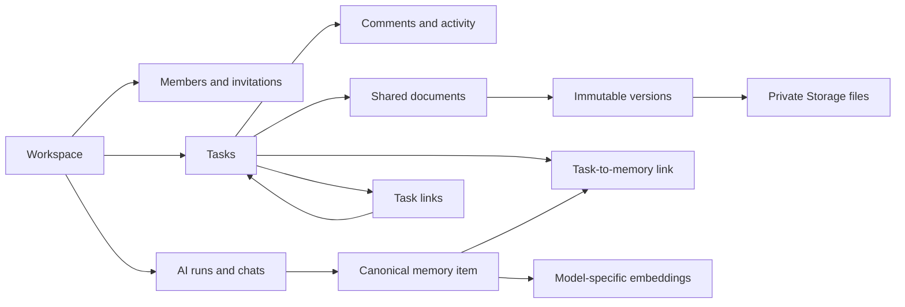

# JuristAI Workspace — Phase 1 data model

Status: schema and Phase 1 API implemented locally. The migrations have not been
applied to Supabase and no Workspace UI has been built yet.

## Product assumptions

- Workspace access is an active `platinum`-only feature. `silver` and `gold`
  remain single-user plans.
- If the Owner's qualifying plan expires, the Workspace becomes read-only for
  everyone. Existing work remains visible and exportable; renewing the plan
  restores writes. Nothing is deleted.
- The existing `admins` account and PostgreSQL-backed Express session remain the
  source of truth for identity. Users do not need to register again.
- The Canvas is desktop-only in Phase 2. Its positions are represented now so
  adding it later does not require reshaping tasks.

## What the structure means in product terms



The model separates a piece of reusable work from the task where it was first
created. A legal answer, research result, or document summary exists once in
`workspace_memory_items`. Any task that needs it points to that same row through
`workspace_task_memory_items`. Team members therefore see prior work without a
second generation and without a second model charge.

A document likewise has one identity in `workspace_documents`, an append-only
history in `workspace_document_versions`, and one or more binary artifacts per
version in `workspace_document_files`. Editing inserts a new version; it never
overwrites the previous one. The physical DOCX/PDF/upload is kept in a private
Supabase Storage bucket, not on Render's ephemeral filesystem.

## Identity bridge

The migration adds `admins.supabase_subject`, a stable UUID for every existing
JuristAI account. It does **not** move authentication to Supabase Auth.

Email invitation acceptance also records how the email was verified
(`google` or `email_otp`). A Telegram-verified registration no longer treats an
unverified optional email as proof of ownership. Existing ambiguous records can
re-verify once through the current email-code service; username invitations are
unaffected.

A signed, short-lived Supabase-compatible JWT is issued only after the existing
Express session is validated. Its important claims are:

```json
{
  "sub": "admins.supabase_subject",
  "app_user_id": 123,
  "role": "authenticated",
  "aud": "authenticated"
}
```

RLS reads `app_user_id`; Storage and Realtime accept the same signed token. This
gives current accounts database-level isolation without migrating passwords,
Telegram login, Google login, OTP, or sessions.

## Core tables

| Area | Tables | Behavior |
|---|---|---|
| Workspace | `workspaces`, `workspace_members`, `workspace_invitations` | One immutable Owner, unlimited Member/Viewer rows, hashed expiring invites. |
| Work | `workspace_tasks`, `workspace_task_assignees`, `workspace_task_watchers`, `workspace_task_comments`, `workspace_task_links`, `workspace_activity_log` | Multi-assignment, watchers, soft deletion, dependency/sub-task/related links, append-only audit history. |
| AI | `workspace_ai_threads`, `workspace_ai_runs`, `workspace_ai_messages` | Workspace/task chat provenance and durable generation state. A queued/running run is stored in Postgres, never only in Render memory. |
| Shared memory | `workspace_memory_items`, `workspace_memory_embeddings`, `workspace_task_memory_items` | One canonical answer or research result can be reused by many tasks. Embedding model and dimensions are explicit because current JuristAI providers produce both 1024- and 1536-dimensional vectors. |
| Documents | `workspace_documents`, `workspace_document_versions`, `workspace_document_files`, `workspace_task_documents` | A stable logical document, immutable versions, private Storage artifacts, and many-to-many task attachment. |
| Phase 2 compatibility | `workspace_task_canvas_positions`, `workspace_saved_views`; `workspace_documents.kind = 'template'` | Supports Canvas, saved views, and a template library later; no Phase 2 UI or API is included now. |

## The reuse rule

For each generation, the API calculates:

1. a `context_fingerprint` from the applicable task facts, current document
   version IDs, relevant shared-memory IDs, the transaction-versioned Lex.uz/RAG
   corpus revision, and prompt-policy version;
2. a `reuse_key` from the normalized request plus that fingerprint.

Before calling a model, it looks for an active `workspace_memory_items` row with
the same Workspace and key. If found, it links the existing result to the current
task and records the AI run as `reused`. If not found, the partial unique index on
active AI runs prevents two members from paying for the same simultaneous
generation. The successful result becomes the one canonical memory item.

When underlying facts or documents change, the fingerprint changes. The new
answer supersedes rather than overwrites the old one, preserving legal provenance.

## Roles enforced by RLS

| Capability | Owner | Member | Viewer |
|---|---:|---:|---:|
| Read workspace work | Yes | Yes | Yes |
| Create/edit tasks and comments | Yes | Yes | No |
| Assign members and link work | Yes | Yes | No |
| Add/remove task watchers | Yes | Yes | No |
| Upload/generate/version documents | Yes | Yes | No |
| Run AI through the API | Yes | Yes | No |
| Invite/remove/change member roles | Yes | No | No |
| Billing/delete workspace | Yes | No | No |

RLS is enabled on every Workspace table. Membership checks run in
`juristai_private` security-definer functions to avoid recursive policies. Browser
clients have read-only table grants; every application-table write requires the
API so invitations, validation, legal prompting, cost controls, provenance, and
reuse checks cannot be bypassed. Private Storage upload is the sole direct browser
write and is independently restricted by Workspace membership RLS.

Direct hard deletion is intentionally absent for Workspaces, tasks, document
versions, document files, and activity. Tasks and Workspaces use soft deletion.
Document versions, file metadata, and activity rows have mutation-blocking
triggers in addition to RLS.

## Live synchronization choice

The schema publishes the Phase 1 tables to `supabase_realtime` with full replica
identity. A client subscribes to Postgres changes with its short-lived bridge JWT;
RLS removes rows from other Workspaces before they reach that client.

Presence uses Supabase Realtime Presence on a private channel such as
`workspace:{workspaceId}:task:{taskId}`. Policies on `realtime.messages` parse the
Workspace UUID from the topic and admit only members. Presence is ephemeral and
therefore does not need an application table. This avoids a permanently warm
WebSocket service and Redis on Render. Scalar edits use last-write-wins;
`workspace_tasks.revision` and `updated_by` support the visible “X updated this
moments ago” notice.

## Storage isolation

The migration creates one private bucket named `workspace-documents`. Paths must
be:

```text
{workspace_uuid}/{document_uuid}/{version_uuid}/{filename}
```

Storage RLS extracts the first segment. A member may read only a Workspace they
belong to; only an Owner or Member of an active Workspace may upload. Browser
update/delete is denied because version artifacts are immutable. Server-side
cleanup of an upload that never acquired database metadata may use the service
role.

## Existing Jamoa migration

The current Jamoa is a platform-wide staff/duty/ranking feature, not a company
boundary. Automatically copying it would place unrelated accounts in the same
Workspace, so it is deliberately **not** migrated.

| Existing data | Treatment |
|---|---|
| `admins` | Preserved as identity records; each receives `supabase_subject`. |
| Existing Jamoa staff roster | Not copied. A Platinum subscriber creates a Workspace and invites only their company team. |
| `requests` and student/lawyer assignments | Remain in the existing So'rov workflow. They do not become tasks automatically. |
| Global `chat_messages` | Preserved as legacy chat; not copied because it has no safe company ownership boundary. |
| Duty hours and rankings | Not migrated; they have no Workspace equivalent and are outside scope. |
| Personal AI chats | Remain private. No automatic sharing into a Workspace. A later explicit “share to Workspace” action can copy selected output with provenance. |
| Existing personal/curated document templates | Remain where they are. Phase 2 can provide an explicit opt-in copy into a Workspace template. |
| Telegram/base64 registration files | Not migrated; they do not have reliable Workspace ownership and must not enter shared Storage automatically. |

The old Jamoa route and UI can be replaced after the Phase 1 Workspace is proven.
Legacy tables should be retained read-only during the pilot and removed only after
an explicit retention decision.

## Migrations

- `migrations/20260822_001_workspace_core.sql`: extensions, identity bridge,
  tables, constraints, indexes, immutable-version rules, automatic task
  attachment, activity triggers.
- `migrations/20260822_002_workspace_rls_realtime_storage.sql`: role helpers,
  complete RLS policies, grants, private Storage bucket policies, and Supabase
  Realtime publication.
- `migrations/20260822_003_workspace_corpus_revision.sql`: a private corpus
  revision counter that invalidates reusable legal answers after any corpus
  insert, correction, invalidation, or deletion.

These scripts are intentionally versioned instead of being added to the current
large startup migration function. The transactional runner uses a
`schema_migrations` checksum ledger and a Postgres advisory lock, and applies each
version exactly once before mounting the Workspace routes.

### Deployment guard implemented

The former startup migration scanned **every** foreign key referencing `admins`
and rewrote its delete behavior. That broad rewrite has been removed. Foreign-key
retention behavior is now owned by explicit migrations, so a Render restart cannot
silently weaken Workspace ownership, provenance, or immutable audit constraints.
